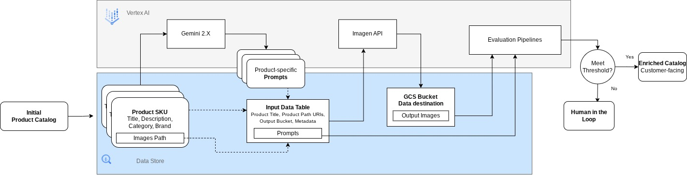

# product_recontext_batch

Product Recontext is a Preview (private) offering of a cutting edge image editing service based on Google’s foundational Imagen model. Using the Product Recontext API, application developers and retailers can generate high quality images of a wide variety of products “recontextualized” in new scenes and backgrounds.

## Sample Workflow Architecture

# Getting Started

* [User Guide](./user-guide/Imagen%20Product%20Recontext%20User%20Guide%20%5BExternal%5D.pdf): Imagen Product Recontext User Guide 
* [imagen_product_recontext_batch_mod.ipynb](./notebooks/imagen_product_recontext_batch_mod.ipynb) : Modified version of the Colab notebook tutorial found in the user guide. Includes an option to generate images at scale by launching asynchronous API calls for each row in an input DataFrame
* [automprompt_recontext_batch.ipynb](./notebooks/automprompt_recontext_batch.ipynb): This notebook scales product image recontextualization by generating prompts from GCS-hosted product images then uses these prompts to process & save images via the Imagen Product Recontextualization API using asynchronous batch jobs.

### Collaborators
beusebio@google.com, isidrodeloera@google.com, layolin@google.com